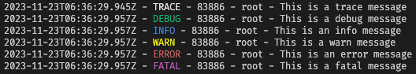

# EventEmitter Based Logging Module

This project contains a basic EventEmitter based logging module.

## Logging Classes and Terminology

The following classes and terminology is used within this project.

### Log Level

A log level, also known as a log severity, is the level of severity of a log
event. The following pre-defined and well known levels are used in this project:
**TRACE**, **DEBUG**, **INFO**, **WARN**, **ERROR** and **FATAL**.

The log level is implemented as the **LogLevel** class, and has a static
read only property for each valid level. The `getLogLevelFromName()` static
method can be used to get a **LogLevel** instance from a log level string.

### Log Event

A log event is the entity that will be logged. A log event is generated by
loggers and picked up by handlers. Generating log events is done by calling
the method associated with a particular log level. These methods take an
extra simple key-value based object for additional data. For example, an error
event with the error message of an error object as additional data would look
like:

```typescript
import { getLogger, Logger } from "@mischareitsma/logging";
const logger: Logger = getLogger();
try {
    // Code goes here
}
catch (e) {
    logger.error("Caught an error", {"errorMessage": e.toString()})
}
```

### Loggers

Loggers are used to trigger and dispatch log events to the appropriate handlers.
Multiple loggers can be used, and each logger has its own set of handlers.

#### Adding and Getting Loggers

Loggers are uniquely defined by their name, and are loaded by passing an
instance of the **Logger** class to the `addLogger()` function:

```typescript
import { addLogger, Logger } from "@mischareitsma/logging";
addLogger(new Logger("my-logger-name"));
```

To get a logger, use the `getLogger()` function:

```typescript
import { getLogger, Logger } from "@mischareitsma/logging";
const logger: Logger = getLogger("my-logger-name");
```

If no name is passed to the `getLogger()` function, the default **root** logger
is returned.

#### Adding Handlers

Log handlers can be added to a logger using the **addLogHandler()** logger
method:

```typescript
import { getLogger, Logger, ConsoleHandler } from "@mischareitsma/logging";
const logger: Logger = getLogger("my-logger-name");
logger.addLogHandler(new ConsoleHandler(LogLevel.INFO));
```

### Handlers

Log handlers implement the actual logging of events. Instances of classes that
implement the **LogHandler** interface have a  **log()** method that takes a
**LogEvent**. This **LogEvent** contains the log level, message, date, name of
the logger that triggered the log event and the additional data structure. The
**log()** method is responsible for formatting and displaying the log message.

Two useful handlers are part of this project: The **ConsoleHandler** and
**FileHandler**.

#### ConsoleHandler

The **ConsoleHandler** will use **console.log()** and **console.error()** to
display log messages, where **console.error()** is used for log levels **ERROR**
and **FATAL**.

The following code snippet shows the ConsoleHandler in action:

```typescript
import { getLogger, Logger, LogHandler, ConsoleHandler, LogLevel } from "@mischareitsma/logging";
const logger: Logger = getLogger();
const consoleHandler: LogHandler = new ConsoleHandler(
    LogLevel.TRACE, // Level of log events that the handlers will process
    true, // Use colors in the terminal for the log levels.
    "my-console-handler", // Name of the handler.
);
logger.addLogHandler(consoleHandler);

logger.trace("This is a trace message");
logger.debug("This is a debug message");
logger.info("This is an info message");
logger.warn("This is a warn message");
logger.error("This is an error message");
logger.fatal("This is a fatal message");
```

Output of running this code is:



#### FileHandler

The **FileHandler** will log all events that it is set to handle to a file. The
following snippet shows the use of the **FileHandler**:

```typescript
import { getLogger, Logger, LogHandler, FileHandler, LogLevel } from "@mischareitsma/logging";
const logger: Logger = getLogger();
const fileHandler: LogHandler = new FileHandler(
    LogLevel.TRACE, // Level of log events that the handlers will process
    "/var/log/my-app.log", // Location of the log file.
    "my-file-handler", // Name of the handler.
);
logger.addLogHandler(fileHandler);

logger.trace("This is a trace message");
logger.debug("This is a debug message");
logger.info("This is an info message");
logger.warn("This is a warn message");
logger.error("This is an error message");
logger.fatal("This is a fatal message");
```

Running this snippet of code results in a log file with the following
content:

```text
2023-11-23T06:43:24.715Z - TRACE - 84336 - root  This is a trace message
2023-11-23T06:43:24.728Z - DEBUG - 84336 - root  This is a debug message
2023-11-23T06:43:24.728Z - INFO - 84336 - root  This is an info message
2023-11-23T06:43:24.728Z - WARN - 84336 - root  This is a warn message
2023-11-23T06:43:24.729Z - ERROR - 84336 - root  This is an error message
2023-11-23T06:43:24.729Z - FATAL - 84336 - root  This is a fatal message
```

## Configuration

This project allows for creating loggers and handlers using configuration only.
This would let an application set up all required logger and handlers with
a simple call to the **loadLoggersAndHandlers()** function.

This function takes a configuration file location as input. If no file is
specified, the function will look at the value stored in the
**LOGGING_CONFIGURATION_PATH** environment variable.

The configuration file itself is a JSON file. This file should adhere to the
[logging](./schemas/logging.json) JSON schema.

### Example Configuration

The following configuration is an example configuration used for testing, and
includes both the **ConsoleHandler** and **FileHandler**, and two loggers:

```json
{
  "loggers": [
    {
      "name": "root",
      "handlers": [
        "handler1",
        "handler2"
      ]
    },
    {
      "name": "app",
      "handlers": [
        "handler2"
      ]
    }
  ],
  "handlers": [
    {
      "name": "handler1",
      "type": "ConsoleHandler",
      "useColors": true,
      "logLevel": "TRACE"
    },
    {
      "name": "handler2",
      "type": "FileHandler",
      "logFile": "/var/log/some-file.log",
      "logLevel": "WARN"
    }
  ]
}
```
